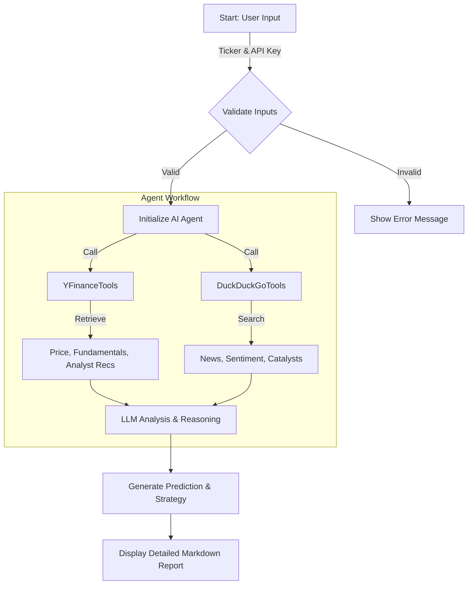

# AI Option Recommender 📈🤖

An AI-powered agent that analyzes stock market data and news to predict weekly price targets and recommend option trading strategies.

## 🚀 Features

- **Multi-Source Analysis**: Combines real-time technical data (YFinance) with latest news sentiment (DuckDuckGo).
- **Price Target Prediction**: Uses LLM reasoning to estimate probable price ranges for the upcoming week.
- **Strategy Recommendations**: Suggests specific option strategies (e.g., Calls, Puts, Iron Condors) based on volatility and direction.
- **Confidence Scoring**: Provides a confidence level and probability assessment for every prediction.

## 🛠️ System Flow



## 📦 Installation

1. **Navigate to the directory**:
   ```bash
   cd advanced_ai_agents/single_agent_apps/option_recommender
   ```

2. **Install dependencies**:
   ```bash
   pip install -r requirements.txt
   ```

## 🏃‍♂️ Usage

1. **Run the Streamlit App**:
   ```bash
   streamlit run option_recommender.py
   ```

2. **Configure the App**:
   - Enter your **OpenAI API Key** in the sidebar.

3. **Get Recommendations**:
   - Enter a stock ticker (e.g., `NVDA`, `AAPL`).
   - Click **Generate Prediction**.
   - View the comprehensive analysis, price target, and option strategy.

## ⚠️ Disclaimer

**This tool is for educational and research purposes only.** Do not use this tool as financial advice. The predictions are generated by an AI model and may be inaccurate. Always do your own due diligence before investing.
